# Guida avvio progetto con Cursor + MCP Wizard

Questa guida spiega passo-passo come creare un nuovo progetto in **Cursor**, collegarlo a GitHub usando il **template** predisposto, ed eseguire il **wizard MCP** per avere immediatamente attivi i Model Context Protocol (MCP) per il progetto.

---

## Prerequisiti

Assicurati di avere:

- **Node.js** v18 o superiore  
  Verifica con:
  ```bash
  node -v
  ```

- **npm, npx e git** installati  
  Verifica con:
  ```bash
  npm -v
  npx -v
  git --version
  ```

- **Cursor installato e CLI attivata**:  
  In Cursor → `Cmd+Shift+P` → digita `Shell Command: Install 'cursor' command in PATH` → Invio.

- **Token GitHub (PAT)** con permessi repo (classic o fine-grained).  
  Crea token GitHub → salvalo in un password manager.

---

## Flusso operativo

### 1. Crea la cartella del progetto in locale

Esempio:
```bash
cd ~/Downloads
mkdir nome-progetto
```

### 2. Apri la cartella in Cursor

In Cursor: **File → Open Project** → seleziona la cartella appena creata.

### 3. Crea un repository su GitHub dal template

1. Vai su [template repository](https://github.com/template-link)
2. Clicca **Use this template** → **Create a new repository**
3. Dai il nome uguale alla cartella locale (es. `nome-progetto`)
4. Imposta la visibilità (public o private)

### 4. Clona il repository nella cartella aperta in Cursor

Nel terminale di Cursor (cartella già aperta):
```bash
git clone https://github.com/TUO-UTENTE/nome-progetto.git .
```

> **Nota**: il `.` alla fine serve per clonare direttamente dentro la cartella corrente.

Se richiede autenticazione:
```bash
git config --global credential.helper store
# poi reinserisci user e token quando richiesto
```

### 5. Esegui il wizard di inizializzazione MCP

```bash
npm run init
```

Il wizard farà:
- ✅ Check prerequisiti (node, npm, git, CLI di Cursor)
- ✅ Verifica accesso a GitHub  
- ✅ Scelta MCP per progetto
  - `1` filesystem (consigliato) → Invio senza scrivere nulla = usa default e crea `.cursor/mcp.json` con root `.`
  - Se lasci default, mostrerà chiaramente: *(verrà creato in questa cartella)*
- ✅ Creazione PRD (`docs/PRD.md`) → `s` per creare
- ✅ Creazione tasks (`.cursor/tasks.json`) → `s` per creare  
- ✅ Creazione file base (`.editorconfig`, `.gitignore`, `README`) → `s` per creare
- ✅ Reload automatico Cursor (se CLI attiva)

---

## Verifica MCP attivi

In chat di Cursor digita:
```bash
/mcp
```

Dovresti vedere il server filesystem attivo e pronto.

---

## Flusso riassunto (diagramma)

```mermaid
flowchart TD
    A[📂 Crea cartella progetto in locale] --> B[🖥 Apri cartella in Cursor]
    B --> C[🌐 Crea repo GitHub dal template]
    C --> D[⬇️ Clona repo nella cartella aperta]
    D --> E[⚙️ npm run init]
    E --> F[📄 Configura MCP + file base]
    F --> G[♻️ Reload automatico Cursor]
    G --> H[💬 /mcp per verificare tool attivi]
```



---

## Comandi utili

**Verificare stato repo:**
```bash
git status
```

**Aggiornare codice remoto:**
```bash
git add .
git commit -m "messaggio"
git push
```

**Rimuovere configurazione MCP progetto:**
```bash
rm -f .cursor/mcp.json
```

**Rilanciare wizard:**
```bash
npm run init
```

---

## Note

- Lo stesso token GitHub vale per più progetti (finché non scade)
- Se il reload automatico non funziona:  
  `Cmd+Shift+P` → digita `Reload Window` → Invio
